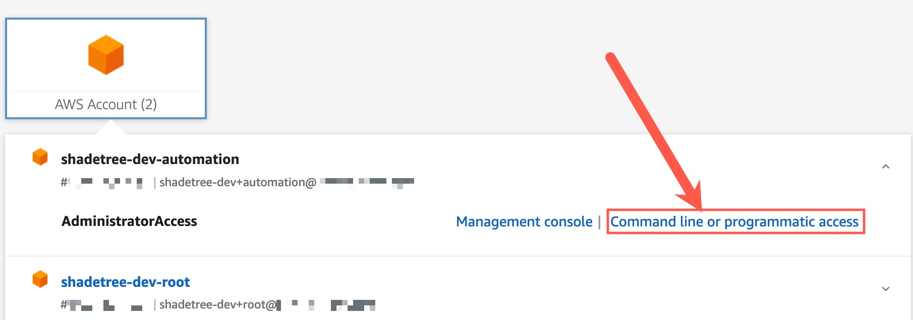

# terraform-backend-creator-example
This project can be used to create a new backend for Terraform that leverages `Amazon S3` + `DynamoDB`, with `KMS Customer Managed Keys (CMK)` for encryption.

This project was created as a complement to blog content written for [https://shadetree.dev](https://shadetree.dev)

**NOTE: The first time this is run you will still be using a [local](https://developer.hashicorp.com/terraform/language/settings/backends/local) `backend` type.** The `backend.tf` configuration is initially commented out intentionally. Once the resources in this project are deployed, you can migrate your state to the `S3 bucket` you've just created for long-term, safe keeping. See the [Migrate State](#migrate-state) section of this `README` for how to do this. 

# Overview
[Terraform State](https://developer.hashicorp.com/terraform/language/state) is the crux of managing your Infrastructure as Code (IaC) reliably, scalably, and securely. If you are leveraging the open source version of Terraform, you can make use of this project to stand up a new `S3 Bucket`, `DynamoDB Table`, and `KMS Customer Managed Key (CMK)` to ensure that you have secure and durable management of your IaC!

For more information on the `S3 backend` type, see [HashiCorp's documentation](https://developer.hashicorp.com/terraform/language/settings/backends/s3).

# Getting Started
This project will help you set up the required components for a `backend` configuration in `Terraform`. You will need to be aware of a few key pieces to get started, but it should require relatively little customization to operationalize!
## Setup
1. Make sure you have [installed the Terraform cli](https://developer.hashicorp.com/terraform/tutorials/aws-get-started/install-cli)
If you are a MacOS user, this can be accomplished via [Homebrew](https://brew.sh/):
```
brew tap hashicorp/tap
brew install hashicorp/tap/terraform
```
2. Ensure that you have access to the AWS account where you will be deploying these resources. It is recommended that you designate a controlled account, ideally managed by your Platform/DevOps team, to make operational reliability and restricting access easy from Day 1!

Depending on whether you are leveraging [AWS IAM Identity Center (SSO)](https://docs.aws.amazon.com/singlesignon/latest/userguide/what-is.html) or have access to a particular `IAM Role`, you will need to comment in/out the correct parameters for your `providers.tf` file.
```
provider "aws" {
  region = var.region
  # for local use, if you can assume the role specified no changes required
  # otherwise, you can use your local SSO profile by commenting OUT assume_role
  # and commenting in your profile
  profile = "automation"
  #   assume_role {
  #     role_arn = "arn:aws:iam::${var.account_id}:role/OrganizationAccountAccessRole"
  #   }
}
```
**NOTE: The `OrganizationAccountAccessRole` is a default role created by AWS. You will need to have a trust policy allowing access to assume it if you use this, otherwise replace it with a valid role in the account**

3. Make sure that you provide the mandatory parameters for this project to deploy. If running this locally, you can `export` the values as environment variables like so:
```
export TF_VAR_account_id="your-account-id"
export TF_VAR_name="your-bucket-name"
export TF_VAR_region="your-aws-region"
```
Optionally, you can also set a `boolean` flag for wheter or not to include specific SSO roles. By default this is `true`, but ***make sure you set the correct `regex` pattern in `data.tf` or set this to `false`!***
```
# example from data.tf
# get our SSO admins, as well, conditionally with a flag
# otherwise lookup might fail and break your plan/apply
data "aws_iam_roles" "sso_roles" {
  count       = var.sso_enabled == true ? 1 : 0
  path_prefix = "/aws-reserved/sso.amazonaws.com/"
  # SET THIS TO YOUR SSO ROLE REGEX PATTERN!
  # NOTE that it will be different per account; the base name is the same
  # but each account gets its own random string appended
  name_regex = ".*Admin*."
}
```

## `terraform init, plan, apply` through `Makefile`
This project includes a `Makefile` that will run your `terraform <command>` functions accordingly, and automatically sets up a [Terraform Workspace](https://developer.hashicorp.com/terraform/language/state/workspaces), which is one of the major benefits of using `S3` as a backend! `Workspaces` allow you to create a hierarchical folder structure, where each child can have its own `terraform.tfstate`, allowing you to centrally manage, but logically separate, all of your IaC!

If you have exported the proper variables as described in the above [Setup](#setup) section, then you should be able to run your commands!
```
make init
# OUTPUT
make plan
# OUTPUT
make apply
```

If you prefer to run the commands yourself, you can simply follow the typical `terraform init` and `terraform plan/apply` stages, but I find the `Makefile` streamlines things and this is a common pattern for managing `Terraform`.

You should see output similar to this if you succeeded:

### init
```
make init                       ✗ ✭
Formatting Terraform files...
Initializing Terraform...
terraform init 

Initializing the backend...
Initializing modules...

Initializing provider plugins...
- Reusing previous version of hashicorp/aws from the dependency lock file
- Using previously-installed hashicorp/aws v5.35.0

Terraform has been successfully initialized!

You may now begin working with Terraform. Try running "terraform plan" to see
any changes that are required for your infrastructure. All Terraform commands
should now work.

If you ever set or change modules or backend configuration for Terraform,
rerun this command to reinitialize your working directory. If you forget, other
commands will detect it and remind you to do so if necessary.
```

### plan
```
make plan
# bunch of output about your resources
.
.
.
Plan: 7 to add, 0 to change, 0 to destroy.

────────────────────────────────────────────────────────────────────────────────────────────

Saved the plan to: tfplan

To perform exactly these actions, run the following command to apply:
    terraform apply "tfplan"
```

### apply
```
make apply                      ✗ ✭
Formatting Terraform files...
Applying Terraform plan...
terraform apply "tfplan"
module.kms.aws_kms_key.tf_key: Creating...
module.kms.aws_kms_key.tf_key: Still creating... [10s elapsed]
module.kms.aws_kms_key.tf_key: Creation complete after 14s [id=<KMS KEY ID>]
module.kms.aws_kms_alias.tf_key: Creating...
module.kms.aws_kms_alias.tf_key: Creation complete after 0s [id=alias/shadetree-dev-example-backend]
module.s3.data.aws_caller_identity.current: Reading...
module.dynamodb.aws_dynamodb_table.tf_state: Creating...
module.s3.aws_s3_bucket.tf_bucket: Creating...
module.s3.data.aws_caller_identity.current: Read complete after 0s [id=<ACCOUNT ID>]
module.s3.aws_s3_bucket.tf_bucket: Creation complete after 2s [id=shadetree-dev-example-backend]
module.s3.aws_s3_bucket_versioning.tf_bucket: Creating...
module.s3.aws_s3_bucket_public_access_block.example: Creating...
module.s3.data.aws_iam_policy_document.bucket_policy: Reading...
module.s3.data.aws_iam_policy_document.bucket_policy: Read complete after 0s [id=<SOME ID>]
module.s3.aws_s3_bucket_policy.tf_access_policy: Creating...
module.s3.aws_s3_bucket_policy.tf_access_policy: Creation complete after 0s [id=shadetree-dev-example-backend]
module.s3.aws_s3_bucket_public_access_block.example: Creation complete after 2s [id=shadetree-dev-example-backend]
module.s3.aws_s3_bucket_versioning.tf_bucket: Creation complete after 3s [id=shadetree-dev-example-backend]
module.dynamodb.aws_dynamodb_table.tf_state: Creation complete after 7s [id=shadetree-dev-example-backend-lock]

Apply complete! Resources: 7 added, 0 changed, 0 destroyed.
```

### destroy
If you want to destroy your resources, you can do so by running `make destroy`, which will prompt you for approval.
```
make destroy
.
.
.
Plan: 0 to add, 0 to change, 7 to destroy.

Do you really want to destroy all resources in workspace "shadetree-dev-example-backend"?
  Terraform will destroy all your managed infrastructure, as shown above.
  There is no undo. Only 'yes' will be accepted to confirm.

  Enter a value: yes
.
.
.
Destroy complete! Resources: 7 destroyed.
```

# Migrate State
Assuming you have **NOT** destroyed the resources from this project and stopped after `apply`, you can now migrate your local `terraform.tfstate` to your new `backend`!

## Uncomment the `backend.tf` configuration
There is already an example `backend.tf` file provided and configured to point to `S3` + `DynamoDB` (and region). Uncomment the lines of this file and update with the bucket name/table name you provided for this project:
```
terraform {
     backend "s3" {
       bucket               = "your-s3-bucket"
       key                  = "terraform.tfstate"
       workspace_key_prefix = "workspaces/terraform-states"
       dynamodb_table       = "your-dynamodb-table"
       encrypt              = true
       region               = "your-region"
     }
}
```

If you notice, we've set the `workspace_key_prefix` to `workspaces/terraform-states`. This means that if you re-run `make init` you should get something like this:
```
make init                       ✗ ✭
Formatting Terraform files...
Initializing Terraform...
terraform init -reconfigure

Initializing the backend...
Do you want to migrate all workspaces to "s3"?
  Both the existing "local" backend and the newly configured "s3" backend
  support workspaces. When migrating between backends, Terraform will copy
  all workspaces (with the same names). THIS WILL OVERWRITE any conflicting
  states in the destination.
  
  Terraform initialization doesn't currently migrate only select workspaces.
  If you want to migrate a select number of workspaces, you must manually
  pull and push those states.
  
  If you answer "yes", Terraform will migrate all states. If you answer
  "no", Terraform will abort.

  Enter a value: yes

  Successfully configured the backend "s3"! Terraform will automatically
  use this backend unless the backend configuration changes.
  Initializing modules...

  Initializing provider plugins...
  - Reusing previous version of hashicorp/aws from the dependency lock file
  - Using previously-installed hashicorp/aws v5.35.0

Terraform has been successfully initialized!
```
And a folder structure in your bucket that looks like:
```
workspaces
└── terraform-states
    └── YOUR-BUCKET-NAME
        └── terraform.tfstate
```
# Troubleshooting
## Problem: `InvalidClientTokenId`

If you get credential errors like below while using the `profile=<your-profile>` in `providers.tf`

│ Error: validating provider credentials: retrieving caller identity from STS: operation error STS: GetCallerIdentity, https response error StatusCode: 403, RequestID: <REQUEST ID>, api error InvalidClientTokenId: The security token included in the request is invalid.

Then you probably have a set of default credentials like `AWS_ACCESS_KEY_ID` and `AWS_SECRET_ACCESS_KEY` in your `~/.aws/credentials` file. 

## Solution: `InvalidClientTokenId`

You can either:
1. Rename your `~/.aws/credentials` temporarily so that the profile from `~/.aws/config` is used instead.
```
mv ~/.aws/credentials ~/.aws/credentials_old
```
2. Export your SSO session information to environment variables, which can be copied from your AWS SSO start page:


The above credentials expire after `1 hour` by default, so once you are done with this project if you later get access issues, make sure to `unset` them:
```
unset AWS_ACCESS_KEY_ID
unset AWS_SECRET_ACCESS_KEY
unset AWS_SESSION_TOKEN
```

## Problem: `ResourceNotFoundException` when migrating state

If you encounter this issue, it often means that the resource you are targeting does not exist in the account you are accessing. If you use SSO profiles, this can be because the `[default]` profile in your `~/.aws/config` file does **NOT** match the account ID you are trying to access for `backend`.

## Solution: `ResourceNotFoundException` when migrating state
You can do one of the following to work around this issue:
1. Modify the `[default]` profile definition
```
[default]
region = us-west-2
output = json
sso_start_url = YOUR-START-URL
sso_region = us-west-2
sso_account_id = BACKEND-ACCOUNT-ID
sso_role_name = AdministratorAccess
```
2. Make use of environment variables to set the profile to use
```
export AWS_PROFILE="backend-account-profile"
# you can find the profile easily with the following command
cat ~/.aws/config | grep your-account-id
```
If you don't have a profile at all and are trying to use them, you can run `aws configure sso` and set one up for that account.

# Terraform Details
This information was generated using [terraform-docs](https://github.com/terraform-docs/terraform-docs). You can install this per the instructions provided in its respective project repository, and then generate a table like below using:
```
terraform-docs markdown table . | pbcopy
```
(the `pbcopy` command is specific to MacOS and used to copy to clipboard; your command may vary)

## Requirements

| Name | Version |
|------|---------|
| <a name="requirement_terraform"></a> [terraform](#requirement\_terraform) | >= 1.5.0 |
| <a name="requirement_aws"></a> [aws](#requirement\_aws) | >= 5.20 |

## Providers

| Name | Version |
|------|---------|
| <a name="provider_aws"></a> [aws](#provider\_aws) | 5.35.0 |

## Modules

| Name | Source | Version |
|------|--------|---------|
| <a name="module_dynamodb"></a> [dynamodb](#module\_dynamodb) | ./modules/dynamodb | n/a |
| <a name="module_kms"></a> [kms](#module\_kms) | ./modules/kms | n/a |
| <a name="module_s3"></a> [s3](#module\_s3) | ./modules/s3 | n/a |

## Resources

| Name | Type |
|------|------|
| [aws_caller_identity.current](https://registry.terraform.io/providers/hashicorp/aws/latest/docs/data-sources/caller_identity) | data source |
| [aws_iam_roles.sso_roles](https://registry.terraform.io/providers/hashicorp/aws/latest/docs/data-sources/iam_roles) | data source |
| [aws_organizations_organization.my_org](https://registry.terraform.io/providers/hashicorp/aws/latest/docs/data-sources/organizations_organization) | data source |

## Inputs

| Name | Description | Type | Default | Required |
|------|-------------|------|---------|:--------:|
| <a name="input_account_id"></a> [account\_id](#input\_account\_id) | The 12 digit AWS account ID to deploy resources to | `string` | `""` | no |
| <a name="input_name"></a> [name](#input\_name) | The name you want to give to resources created | `string` | `""` | no |
| <a name="input_region"></a> [region](#input\_region) | The AWS region where resources should be deployed | `string` | `"us-west-2"` | no |
| <a name="input_sso_enabled"></a> [sso\_enabled](#input\_sso\_enabled) | Flag for whether or not to look up SSO role for bucket and key access | `bool` | `true` | no |

## Outputs

| Name | Description |
|------|-------------|
| <a name="output_dynamodb_table_arn"></a> [dynamodb\_table\_arn](#output\_dynamodb\_table\_arn) | The ARN of the DynamoDB table created for state lock |
| <a name="output_kms_key_arn"></a> [kms\_key\_arn](#output\_kms\_key\_arn) | The ARN of the KMS key created for encrypting our resources |
| <a name="output_s3_bucket_arn"></a> [s3\_bucket\_arn](#output\_s3\_bucket\_arn) | The ID (name) of the bucket created |

---
### LICENSE:
This project is licensed under the MIT License.